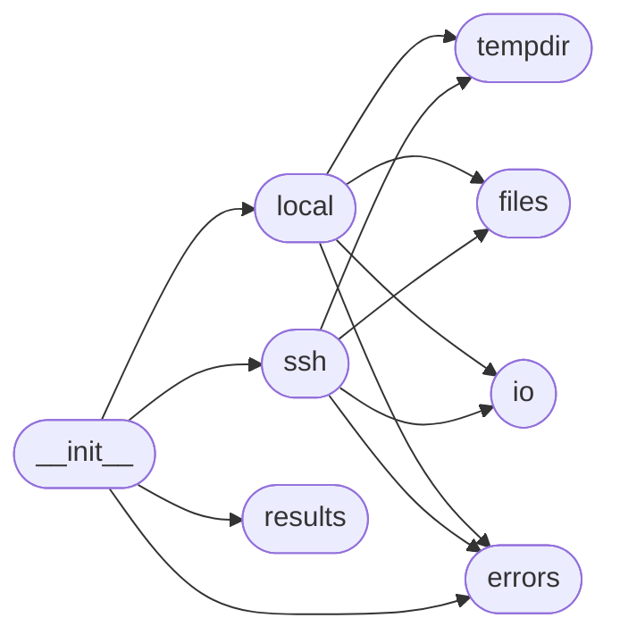

# Code Overview

[_Documentation generated by Documatic_](https://www.documatic.com)

<!---Documatic-section-Codebase Structure Python-start--->
## Codebase Structure Python

The codebase has a flat structure, with 8 code files.

<!---Documatic-block-system_architecture-start--->

<!---Documatic-block-system_architecture-end--->

# #
<!---Documatic-section-Codebase Structure Python-end--->

<!---Documatic-section-Key Objects-start--->
## Key Objects

There are exposed imports at level-0
from the source directory (spur)

<!---Documatic-block-spur-start--->

	
<code>spur</code> (Click to Expand!)

* `spur.errors.CommandInitializationError`
* `spur.errors.CouldNotChangeDirectoryError`
* `spur.errors.NoSuchCommandError`
* `spur.local.LocalShell`
* `spur.results.RunProcessError`
* `spur.ssh.SshShell`

<!---Documatic-block-spur-end--->

# #
<!---Documatic-section-Key Objects-end--->

<!---Documatic-section-Important Functions-start--->
## Important Functions

<!---Documatic-block-important_funcs-start--->
<!---Documatic-block-most_used_funcs-start--->
### Most Utilised Functions

* [spur.tempdir.create_temporary_dir](5-spur_tempdir.md#spur.tempdir.create_temporary_dir) (2 times)
<!---Documatic-block-most_used_funcs-end--->

<!---Documatic-block-end_user_funcs-start--->
### End User Exposed Functions

* [spur.errors.CouldNotChangeDirectoryError](4-spur_errors.md#spur.errors.CouldNotChangeDirectoryError)
* [spur.errors.NoSuchCommandError](4-spur_errors.md#spur.errors.NoSuchCommandError)
* [spur.ssh.SshShell](6-spur_ssh.md#spur.ssh.SshShell)
* [spur.errors.CommandInitializationError](4-spur_errors.md#spur.errors.CommandInitializationError)
* [spur.local.LocalShell](3-spur_local.md#spur.local.LocalShell)
* [spur.results.RunProcessError](7-spur_results.md#spur.results.RunProcessError)
<!---Documatic-block-end_user_funcs-end--->
<!---Documatic-block-important_funcs-end--->

# #
<!---Documatic-section-Important Functions-end--->

<!---Documatic-section-File IO-start--->
## File IO

<!---Documatic-block-file_io-start--->
The following files have file write operations

<!---Documatic-block-spur-start--->

	
<code>spur</code> (Click to Expand!)

* spur.files
* spur.local

<!---Documatic-block-spur-end--->
<!---Documatic-block-file_io-end--->

# #
<!---Documatic-section-File IO-end--->

<!---Documatic-section-Class Hierarchy-start--->
## Class Hierarchy

<!---Documatic-block-Exception-start--->

	
<code>Exception</code> (Click to Expand!)

* [spur.errors.CommandInitializationError](4-spur_errors.md#spur.errors.CommandInitializationError)

<!---Documatic-block-Exception-end--->

<!---Documatic-block-OSError-start--->

	
<code>OSError</code> (Click to Expand!)

* [spur.errors.CouldNotChangeDirectoryError](4-spur_errors.md#spur.errors.CouldNotChangeDirectoryError)
* [spur.errors.NoSuchCommandError](4-spur_errors.md#spur.errors.NoSuchCommandError)

<!---Documatic-block-OSError-end--->

<!---Documatic-block-object-start--->

	
<code>object</code> (Click to Expand!)

* spur.files.FileOperations
* spur.io.Channel
* spur.io.IoHandler
* spur.io._ContinuousReader
* spur.io._ReadOutputAtEnd
* spur.local.LocalProcess
* [spur.local.LocalShell](3-spur_local.md#spur.local.LocalShell)

<!---Documatic-block-object-end--->

# #
<!---Documatic-section-Class Hierarchy-end--->

[_Documentation generated by Documatic_](https://www.documatic.com)