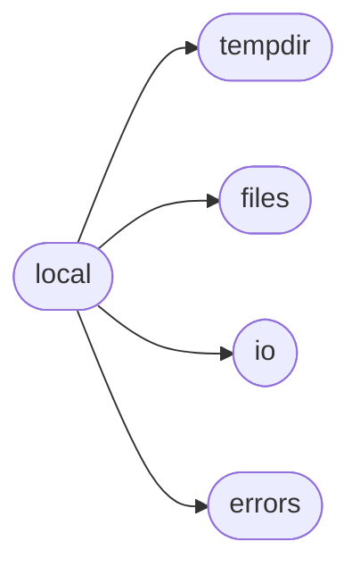

# Spur Local

[_Documentation generated by Documatic_](https://www.documatic.com)

<!---Documatic-section-Codebase Structure-start--->
## Codebase Structure

<!---Documatic-block-system_architecture-start--->

<!---Documatic-block-system_architecture-end--->

# #
<!---Documatic-section-Codebase Structure-end--->

<!---Documatic-section-spur.local.LocalShell-start--->
## [spur.local.LocalShell](3-spur_local.md#spur.local.LocalShell)

<!---Documatic-section-LocalShell-start--->
<!---Documatic-block-spur.local.LocalShell-start--->
<details>
	<summary><code>spur.local.LocalShell</code> code snippet</summary>

```python
class LocalShell(object):

    def __enter__(self):
        return self

    def __exit__(self, *args):
        self.close()

    def close(self):
        pass

    def upload_dir(self, source, dest, ignore=None):
        shutil.copytree(source, dest, ignore=shutil.ignore_patterns(*ignore))

    def upload_file(self, source, dest):
        shutil.copyfile(source, dest)

    def open(self, name, mode='r'):
        return open(name, mode)

    def write_file(self, remote_path, contents):
        subprocess.check_call(['mkdir', '-p', os.path.dirname(remote_path)])
        open(remote_path, 'w').write(contents)

    def spawn(self, command, *args, **kwargs):
        stdout = kwargs.pop('stdout', None)
        stderr = kwargs.pop('stderr', None)
        allow_error = kwargs.pop('allow_error', False)
        store_pid = kwargs.pop('store_pid', False)
        use_pty = kwargs.pop('use_pty', False)
        encoding = kwargs.pop('encoding', None)
        cwd = kwargs.get('cwd')
        if use_pty:
            if pty is None:
                raise ValueError('use_pty is not supported when the pty module cannot be imported')
            (master, slave) = pty.openpty()
            stdin_arg = slave
            stdout_arg = slave
            stderr_arg = subprocess.STDOUT
        else:
            stdin_arg = subprocess.PIPE
            stdout_arg = subprocess.PIPE
            stderr_arg = subprocess.PIPE
        try:
            process = subprocess.Popen(stdin=stdin_arg, stdout=stdout_arg, stderr=stderr_arg, bufsize=0, **self._subprocess_args(command, *args, **kwargs))
        except OSError as error:
            if cwd is not None and self._is_cannot_change_directory_oserror(error, cwd):
                raise CouldNotChangeDirectoryError(cwd, error)
            elif self._is_no_such_command_oserror(error, command[0]):
                raise NoSuchCommandError(command[0])
            else:
                raise
        if use_pty:
            process_stdin = os.fdopen(os.dup(master), 'wb', 0)
            process_stdout = os.fdopen(master, 'rb', 0)
            process_stderr = io.BytesIO()

            def close_slave_on_exit():
                process.wait()
                os.close(slave)
            thread = threading.Thread(target=close_slave_on_exit)
            thread.daemon = True
            thread.start()
        else:
            process_stdin = process.stdin
            process_stdout = process.stdout
            process_stderr = process.stderr
        spur_process = LocalProcess(process, allow_error=allow_error, process_stdin=process_stdin, io_handler=IoHandler([Channel(process_stdout, stdout, is_pty=use_pty), Channel(process_stderr, stderr, is_pty=use_pty)], encoding=encoding))
        if store_pid:
            spur_process.pid = process.pid
        return spur_process

    def run(self, *args, **kwargs):
        return self.spawn(*args, **kwargs).wait_for_result()

    def temporary_dir(self):
        return create_temporary_dir()

    @property
    def files(self):
        return FileOperations(self)

    def _subprocess_args(self, command, cwd=None, update_env=None, new_process_group=False):
        kwargs = {'args': command, 'cwd': cwd}
        if update_env is not None:
            new_env = os.environ.copy()
            new_env.update(update_env)
            kwargs['env'] = new_env
        if new_process_group:
            kwargs['preexec_fn'] = os.setpgrp
        return kwargs

    def _is_no_such_command_oserror(self, error, command):
        if error.errno != errno.ENOENT:
            return False
        elif sys.version_info[0] < 3:
            return error.filename is None
        else:
            return error.args[1] == os.strerror(error.errno) + ': ' + repr(command)

    def _is_cannot_change_directory_oserror(self, error, directory):
        if sys.version_info[0] < 3:
            return error.filename == directory
        else:
            return error.args[1] == os.strerror(error.errno) + ': ' + repr(directory) or not os.access(directory, os.X_OK)
```
</details>
<!---Documatic-block-spur.local.LocalShell-end--->
<!---Documatic-section-LocalShell-end--->

# #
<!---Documatic-section-spur.local.LocalShell-end--->

[_Documentation generated by Documatic_](https://www.documatic.com)