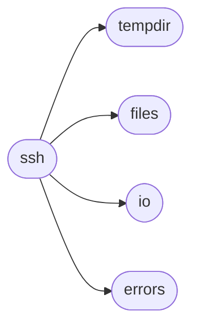

# Spur Ssh

[_Documentation generated by Documatic_](https://www.documatic.com)

<!---Documatic-section-Codebase Structure-start--->
## Codebase Structure

<!---Documatic-block-system_architecture-start--->

<!---Documatic-block-system_architecture-end--->

# #
<!---Documatic-section-Codebase Structure-end--->

<!---Documatic-section-spur.ssh.SshShell-start--->
## [spur.ssh.SshShell](6-spur_ssh.md#spur.ssh.SshShell)

<!---Documatic-section-SshShell-start--->
<!---Documatic-block-spur.ssh.SshShell-start--->
<details>
	<summary><code>spur.ssh.SshShell</code> code snippet</summary>

```python
class SshShell(object):

    def __init__(self, hostname, username=None, password=None, port=None, private_key_file=None, connect_timeout=None, missing_host_key=None, shell_type=None, look_for_private_keys=True, load_system_host_keys=True, sock=None):
        if connect_timeout is None:
            connect_timeout = _ONE_MINUTE
        if port is None:
            port = 22
        if shell_type is None:
            shell_type = ShellTypes.sh
        self._hostname = hostname
        self._port = port
        self._username = username
        self._password = password
        self._private_key_file = private_key_file
        self._client = None
        self._connect_timeout = connect_timeout
        self._look_for_private_keys = look_for_private_keys
        self._load_system_host_keys = load_system_host_keys
        self._closed = False
        self._sock = sock
        if missing_host_key is None:
            self._missing_host_key = MissingHostKey.raise_error
        else:
            self._missing_host_key = missing_host_key
        self._shell_type = shell_type

    def __enter__(self):
        return self

    def __exit__(self, *args):
        self.close()

    def close(self):
        self._closed = True
        if self._client is not None:
            self._client.close()

    def run(self, *args, **kwargs):
        return self.spawn(*args, **kwargs).wait_for_result()

    def spawn(self, command, *args, **kwargs):
        stdout = kwargs.pop('stdout', None)
        stderr = kwargs.pop('stderr', None)
        allow_error = kwargs.pop('allow_error', False)
        store_pid = kwargs.pop('store_pid', False)
        use_pty = kwargs.pop('use_pty', False)
        encoding = kwargs.pop('encoding', None)
        cwd = kwargs.get('cwd')
        command_in_cwd = self._shell_type.generate_run_command(command, *args, store_pid=store_pid, **kwargs)
        try:
            channel = self._get_ssh_transport().open_session()
        except EOFError as error:
            raise self._connection_error(error)
        if use_pty:
            channel.get_pty()
        channel.exec_command(command_in_cwd)
        process_stdout = channel.makefile('rb')
        if store_pid:
            pid = _read_int_initialization_line(process_stdout)
        if cwd is not None:
            cd_output = []
            while True:
                line = process_stdout.readline()
                if line.startswith(b'spur-cd: '):
                    if line.strip() == b'spur-cd: 0':
                        break
                    else:
                        raise CouldNotChangeDirectoryError(cwd, b''.join(cd_output))
                else:
                    cd_output.append(line)
        if self._shell_type.supports_which:
            which_return_code = _read_int_initialization_line(process_stdout)
            if which_return_code != 0:
                raise NoSuchCommandError(command[0])
        process = SshProcess(channel, allow_error=allow_error, process_stdout=process_stdout, stdout=stdout, stderr=stderr, encoding=encoding, shell=self)
        if store_pid:
            process.pid = pid
        return process

    @contextlib.contextmanager
    def temporary_dir(self):
        result = self.run(['mktemp', '--directory'], encoding='ascii')
        temp_dir = result.output.strip()
        try:
            yield temp_dir
        finally:
            self.run(['rm', '-rf', temp_dir])

    def upload_dir(self, local_dir, remote_dir, ignore):
        with create_temporary_dir() as temp_dir:
            content_tarball_path = os.path.join(temp_dir, 'content.tar.gz')
            content_path = os.path.join(temp_dir, 'content')
            shutil.copytree(local_dir, content_path, ignore=shutil.ignore_patterns(*ignore))
            subprocess.check_call(['tar', 'czf', content_tarball_path, 'content'], cwd=temp_dir)
            with self._connect_sftp() as sftp:
                remote_tarball_path = '/tmp/{0}.tar.gz'.format(uuid.uuid4())
                sftp.put(content_tarball_path, remote_tarball_path)
                self.run(['mkdir', '-p', remote_dir])
                self.run(['tar', 'xzf', remote_tarball_path, '--strip-components', '1', '--directory', remote_dir])
                sftp.remove(remote_tarball_path)

    def open(self, name, mode='r'):
        sftp = self._open_sftp_client()
        sftp_file = SftpFile(sftp, sftp.open(name, mode), mode)
        if 'b' not in mode:
            sftp_file = io.TextIOWrapper(sftp_file)
        return sftp_file

    @property
    def files(self):
        return FileOperations(self)

    def _get_ssh_transport(self):
        try:
            return self._connect_ssh().get_transport()
        except (socket.error, paramiko.SSHException, EOFError) as error:
            raise self._connection_error(error)

    def _connect_ssh(self):
        if self._client is None:
            if self._closed:
                raise RuntimeError('Shell is closed')
            client = paramiko.SSHClient()
            if self._load_system_host_keys:
                client.load_system_host_keys()
            client.set_missing_host_key_policy(self._missing_host_key)
            client.connect(hostname=self._hostname, port=self._port, username=self._username, password=self._password, key_filename=self._private_key_file, look_for_keys=self._look_for_private_keys, timeout=self._connect_timeout, sock=self._sock)
            self._client = client
        return self._client

    @contextlib.contextmanager
    def _connect_sftp(self):
        sftp = self._open_sftp_client()
        try:
            yield sftp
        finally:
            sftp.close()

    def _open_sftp_client(self):
        return self._get_ssh_transport().open_sftp_client()

    def _connection_error(self, error):
        connection_error = ConnectionError('Error creating SSH connection\n' + 'Original error: {0}'.format(error))
        connection_error.original_error = error
        connection_error.original_traceback = traceback.format_exc()
        return connection_error
```
</details>
<!---Documatic-block-spur.ssh.SshShell-end--->
<!---Documatic-section-SshShell-end--->

# #
<!---Documatic-section-spur.ssh.SshShell-end--->

[_Documentation generated by Documatic_](https://www.documatic.com)